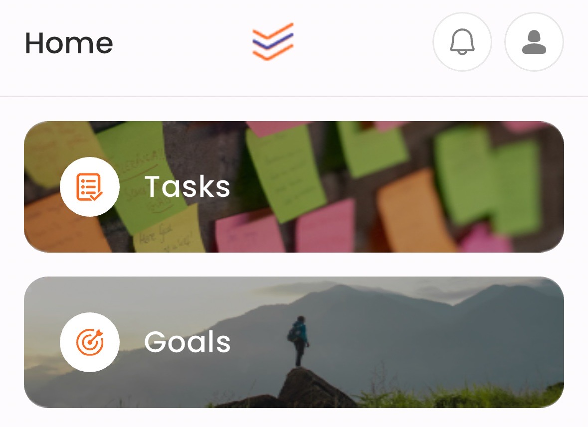
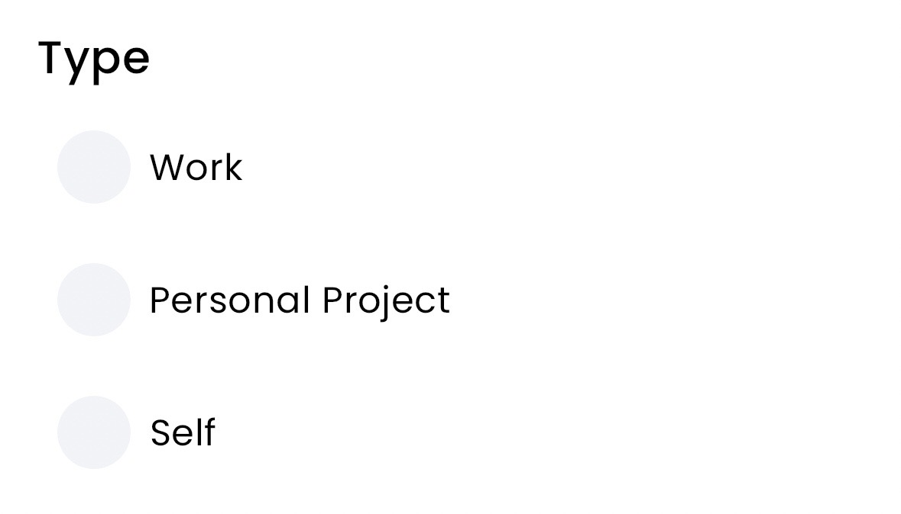

# TaskRM

TaskRM is a fresh take on project and task management

The goal is to allow the user to be able to track everything that they want or need to do, while only focusing on what is actually important for the day.  

The catalog of all of the things that need to get done are pushed to the background, and the focus and attention is brought to only the most important items.  

Over time the user learns what they are realistically capable of in an average day, and how to set appropriate expectations.  

----

The core of the application is built around the idea of tasks and goals

Projects are also considered goals, and goals can be nested beneath each other to create progressive acheivements. 

----

When creating tasks and goals, users have the opportunity to choose a 'type' 

Types allow users to separate their work life from their personal life, and even separate out work for their own personal projects.  

----

Timeframes are the most important aspect of creating a task.  

When we create a task, we want to try and estimate the timeframe we would like to see it completed in.  

| Today | 3 Days | Week | Fortnight | Month | 90 Days | Year |
| :---: | :---: | :---: | :---: | :---: | :---: | :---: |

As time marches forward and the user continues choosing their daily tasks, they will see their deadlines approaching and be forced to deal with them, or extend them.
